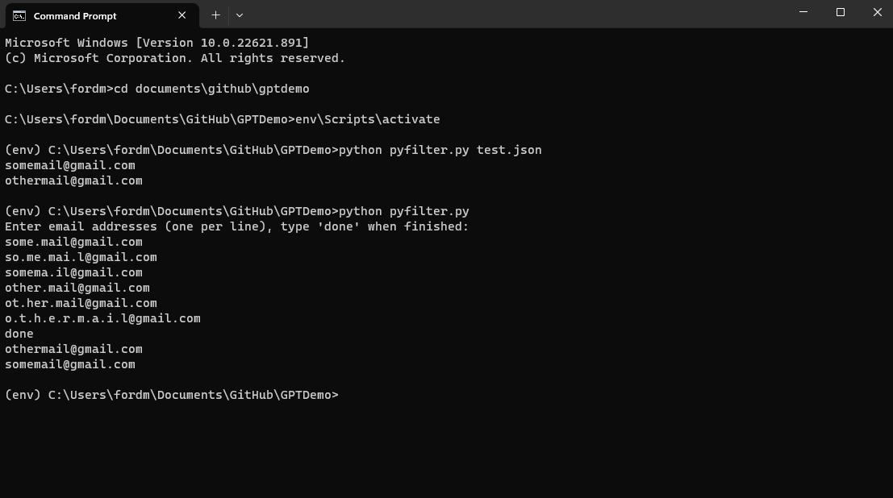

# Email Filtering Script

This script takes a list of email addresses, applies character ignoring, removes duplicates, and prints the unique email addresses.

## Usage

```shell
python email_filter.py [input_file.json]
```

`input_file.json` (optional): Provide a JSON file containing a list of email addresses. If not provided, the script will read email addresses from STDIN.
<div>&nbsp</div>

